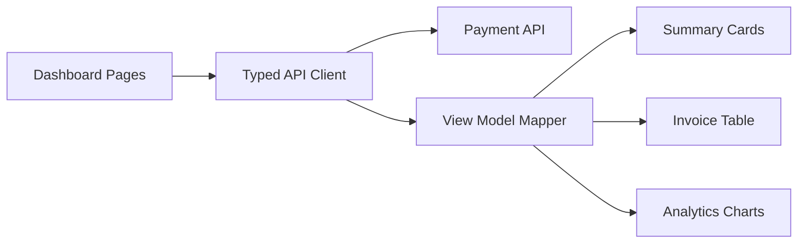

# ZyraPayments Merchant Dashboard

Public engineering case study for a merchant dashboard in a crypto payments platform. The production dashboard gives merchants visibility into invoices, payment status, settings, integration data, and operational analytics.

This repository focuses on the product and engineering shape of the dashboard: normalized view models, testable aggregations, reliable metrics, and safe separation between UI and payment infrastructure.

## Problem

Merchants do not want raw provider data. They need clear answers:

- how much volume was processed;
- which invoices are paid, pending, or expired;
- whether integration settings are healthy;
- how payment status changes over time;
- where operational issues require attention.

The challenge is to turn backend payment data into trustworthy product-facing analytics.

## Solution

The dashboard uses a frontend-oriented data layer:

- API responses are mapped into normalized payment view models;
- summary cards are derived from source-of-truth payment data;
- tables, filters, and charts use predictable data shapes;
- sensitive merchant settings are redacted or server-protected;
- derived metrics are documented as product contracts.

## Key Features

- Merchant overview with payment summary cards.
- Invoice list and status filtering.
- Integration/settings surface.
- Payment analytics and chart-ready data.
- Safe aggregation examples.
- CI-tested summary logic.

## Architecture



The dashboard is intentionally not coupled to raw provider responses. This makes UI behavior stable even when backend/provider internals evolve.

## Tech Stack

- Next.js, React, TypeScript.
- Tailwind CSS, Radix UI, chart components.
- Payment API/MySQL-backed data in production.
- Vitest and GitHub Actions for tests/CI.

## Engineering Highlights

- `docs/adr/0001-normalized-dashboard-view-models.md` documents why dashboard view models are normalized.
- `examples/payment-summary/paymentSummary.ts` demonstrates testable payment aggregation.
- `tests/paymentSummary.test.ts` covers totals, status counts, and empty state.
- `docs/production.md` covers merchant scoping, redaction, caching, observability, and data quality.
- `docs/roadmap.md` outlines pagination, async exports, precomputed analytics, and chart transformation tests.

## Production Considerations

Dashboards are product surfaces, but they are also operational tools. Production concerns include:

- merchant-scoped queries;
- not exposing API secrets after creation;
- consistent timezone and rounding rules;
- paginated exports;
- dashboard totals matching backend ledger definitions;
- monitoring chart query latency and data discrepancies.

## Public vs Private

Included in this repository:

- dashboard architecture notes;
- summary aggregation example;
- tests and CI;
- ADR, production docs, roadmap.

Excluded from this repository:

- merchant secrets;
- real payment data;
- webhook URLs;
- database credentials;
- JWT secrets;
- private settlement logic.

## Local Development

```bash
npm install
npm run typecheck
npm test
```
