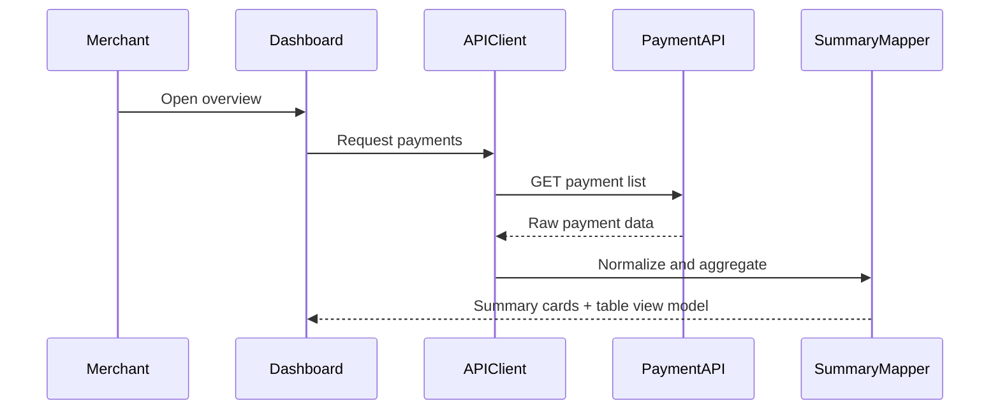

# Architecture

```text
Dashboard Pages -> Data Fetching Layer -> Payment API
       |                    |
       v                    v
 Summary Cards        Invoice Table
```

## Notes

- UI modules consume normalized payment view models.
- Raw provider responses are not exposed to dashboard components.
- Filtering and aggregation can be tested independently.

## Sequence: Dashboard Summary


